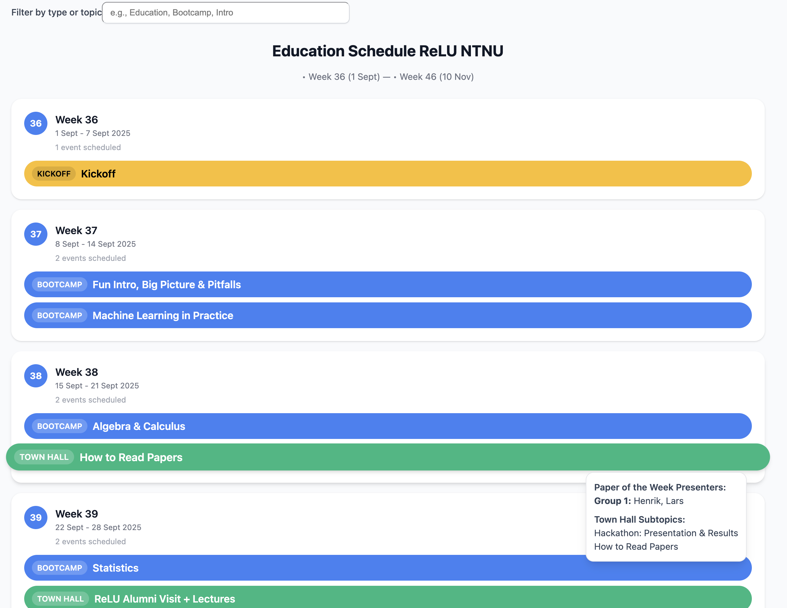

# ReLU NTNU — Education Schedule

A responsive React + TypeScript application (Vite) that displays the ReLU NTNU education schedule in a calendar-like grid, sourced from Google Sheets.



## Features

-   📅 **Responsive Calendar Grid**: Displays schedule data in an organized weekly view
-   🔗 **Google Sheets Integration**: Fetches live data from Google Sheets API v4
-   📱 **Mobile-First Design**: Fully responsive design that works on all devices
-   🔄 **Graceful Fallback**: Uses a small mock when Google Sheets API key is missing/unavailable
-   ⚡ **Fast Performance**: Built with Vite for optimal development and production performance

## Data Source

-   **Google Sheets Link**: [ReLU NTNU Schedule](https://docs.google.com/spreadsheets/d/1PLwtDb_ODhWJ8bsQajqDORCa_XWr1FkTKLe795_lr3k/edit?gid=1788585293#gid=1788585293)
-   **Spreadsheet ID**: `1PLwtDb_ODhWJ8bsQajqDORCa_XWr1FkTKLe795_lr3k`
-   **Sheet GID**: `1788585293`
-   **Columns**: Week, Type, Topic, Subtopics (case-insensitive)

The application forward-fills missing Week values from the last seen row.

## Getting Started

### Prerequisites

-   Node.js (version 16 or higher)
-   npm or yarn

### Installation

1. Clone the repository:

```bash
git clone https://github.com/bendiknorli/relu-schedule.git
cd relu-schedule
```

2. Install dependencies:

```bash
npm install
```

3. Start the development server:

```bash
npm run dev
```

4. Open your browser and navigate to `http://localhost:5173`

### Building for Production

```bash
npm run build
```

The built files will be available in the `dist` directory.

### Linting

```bash
npm run lint
```

## Technology Stack

-   **React**: Modern React with hooks
-   **TypeScript**: Type-safe development
-   **Vite**: Fast build tool and development server
-   **Axios**: HTTP client for API requests

## Project Structure

```
src/
├── api/
│   └── googleSheets.ts      # Fetch/transform from Google Sheets
├── components/
│   ├── EventChip.tsx        # Event chip with hover/focus popover
│   ├── Legend.tsx           # Type color keys
│   ├── WeekCard.tsx         # Week card with events
│   ├── ScheduleGrid.tsx     # Grid + title + breadcrumbs
│   └── ui/
│       ├── badge.tsx
│       ├── card.tsx
│       └── popover.tsx
├── lib/
│   └── utils.ts             # cn helper
├── types.ts                 # Event types and ordering
├── App.tsx                  # App + filter input
├── index.css                # Global styles
└── main.tsx                 # App entry
```
